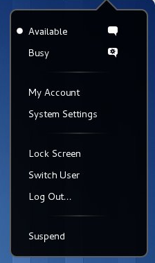

title: GNOME 3 doesn't have a fucking shutdown button.

It just doesn't.  You're not supposed to every power off a GNOME 3 powered
machine.

Let me reiterate. IT DOESN'T HAVE A FUCKING SHUTDOWN BUTTON.
What are these GNOME people thinking?!?!

